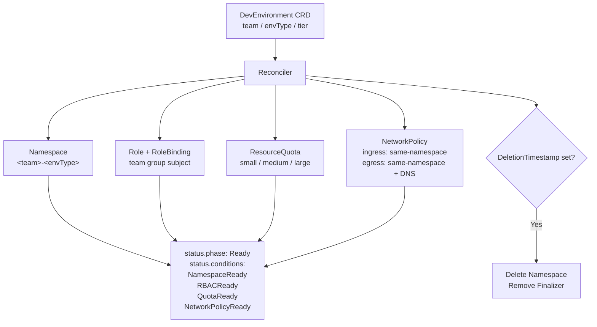

# PlatformPilot Operator

A Kubernetes operator that automates dev environment provisioning for engineering teams. When a `DevEnvironment` custom resource is applied, the operator reconciles a fully isolated namespace with scoped RBAC, tier-based resource quotas, and a network policy that restricts cross-namespace traffic — removing the manual toil of wiring these up per team and per environment type.

---

## Architecture



All child resources carry an owner reference back to the `DevEnvironment` object.

---

## CRD Spec Reference

| Field | Type | Required | Description |
|-------|------|----------|-------------|
| `team` | `string` | Yes | Team name — used as the namespace prefix and RBAC group subject |
| `envType` | `string` | Yes | Environment type: `dev` or `staging` |
| `tier` | `string` | Yes | Resource tier: `small`, `medium`, or `large` |
| `services` | `[]string` | No | Optional list of services to provision (e.g. `postgres`, `redis`) — not yet implemented |

Namespace naming convention: `<team>-<envType>` (e.g. `payments-dev`).

---

## Tier Sizing

| Tier | CPU Request | CPU Limit | Memory Request | Memory Limit | Max Pods |
|------|-------------|-----------|----------------|--------------|----------|
| `small` | 2 | 4 | 2 Gi | 4 Gi | 10 |
| `medium` | 4 | 8 | 8 Gi | 16 Gi | 20 |
| `large` | 8 | 16 | 16 Gi | 32 Gi | 50 |

---

## Quick Start

**Prerequisites:** Go 1.24+, kubectl, and a running Kubernetes cluster (e.g. kind, k3d).

**Install the CRD:**

```sh
make install
```

**Run the operator locally (outside the cluster):**

```sh
make run
```

**Apply a sample DevEnvironment:**

```sh
kubectl apply -f config/samples/
```

**Uninstall:**

```sh
make uninstall
```

---

## Example DevEnvironment

```yaml
apiVersion: platform.platformpilot.io/v1alpha1
kind: DevEnvironment
metadata:
  name: payments-dev
spec:
  team: payments
  envType: dev
  tier: medium
```

This creates:
- Namespace `payments-dev`
- Role `payments-dev-role` with full access to pods, services, deployments, ingresses, PVCs, configmaps, and secrets
- RoleBinding `payments-dev-rolebinding` binding the `payments` group to that role
- ResourceQuota `payments-dev-resourcequota` with medium-tier limits
- NetworkPolicy `payments-dev-networkpolicy` allowing intra-namespace ingress and egress, plus UDP/53 for DNS

---

## Testing with kubectl

**Apply the resource:**

```sh
kubectl apply -f config/samples/
```

**Inspect status and conditions:**

```sh
kubectl describe devenvironment payments-dev
```

Expected output excerpt:

```
Status:
  Phase: Ready
  Conditions:
    Type:    NamespaceReady
    Status:  True
    Reason:  NamespaceProvisioned
    ...
    Type:    RBACReady
    Status:  True
    ...
    Type:    QuotaReady
    Status:  True
    ...
    Type:    NetworkPolicyReady
    Status:  True
```

**Verify child resources:**

```sh
kubectl get namespace payments-dev
kubectl get role,rolebinding -n payments-dev
kubectl get resourcequota -n payments-dev
kubectl get networkpolicy -n payments-dev
```

**Delete and confirm cleanup (finalizer-driven):**

```sh
kubectl delete devenvironment payments-dev
# Operator removes the namespace before releasing the finalizer
kubectl get namespace payments-dev  # should be gone
```

---

## Status

**Implemented**
- `DevEnvironment` CRD with kubebuilder validation markers (cluster-scoped)
- Finalizer `platformpilot.io/cleanup` — deletes the owned namespace on CR deletion
- Namespace provisioning with PlatformPilot labels and owner reference
- Scoped RBAC (Role + RoleBinding) per team with owner references
- Tier-based ResourceQuota (small / medium / large) with owner reference
- NetworkPolicy: ingress from same-namespace pods, egress to same-namespace pods + DNS (UDP/53)
- Status subresource: `phase` (`Provisioning` → `Ready`) and four conditions (`NamespaceReady`, `RBACReady`, `QuotaReady`, `NetworkPolicyReady`)

**Planned**
- Services provisioning (deploy postgres/redis StatefulSets from `spec.services`)
- Webhook validation (reject unknown tier/envType values at admission time)
- Error-path condition updates (set conditions to `False` with a reason before returning on failure)
- Controller tests with envtest

---

## Tech Stack

| Layer | Technology |
|-------|-----------|
| Language | Go 1.24+ |
| Operator framework | [Kubebuilder](https://book.kubebuilder.io) v4 |
| Controller runtime | [controller-runtime](https://github.com/kubernetes-sigs/controller-runtime) v0.23 |
| CRD API version | `platform.platformpilot.io/v1alpha1` |

---

## License

Apache 2.0 — see [LICENSE](LICENSE).
