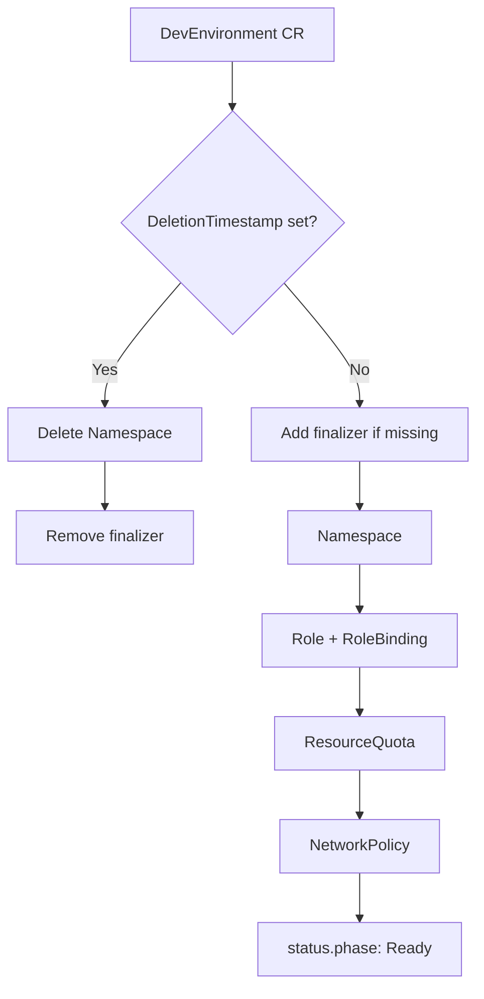

# platformpilot-operator

A Kubernetes operator that provisions a fully isolated dev environment from a single `DevEnvironment` custom resource: namespace, scoped RBAC, tier-sized ResourceQuota, and a default-deny NetworkPolicy with DNS egress allowed.


[](https://github.com/yuvalRipkin/platformpilot-operator/actions/workflows/ci.yaml)

---

## Overview

Engineering teams provisioning dev environments manually drift on namespace naming, RBAC scope, and resource limits. Every team ends up with slightly different conventions and no enforcement at the cluster level. When environments are created ad-hoc, the guardrails that matter — quota, network isolation, RBAC — are the first things omitted under time pressure.

This operator codifies the contract in a single CRD. One `DevEnvironment` resource creates a namespace named `<team>-<envType>`, a Role and RoleBinding scoped to that namespace with the team's group as the subject, a tier-sized ResourceQuota, and a NetworkPolicy that restricts traffic to intra-namespace pods while blocking cross-namespace communication. Deletion is handled by a finalizer that explicitly removes the namespace before releasing the object.

> Part of [PlatformPilot](https://github.com/yuvalRipkin/platformpilot).

---

## What it provisions

Applying a `DevEnvironment` CR triggers reconciliation in this order:

| Step | Resource | Name pattern | Notes |
|------|----------|--------------|-------|
| 1 | `Namespace` | `<team>-<envType>` | Labeled with `platformpilot.io/team`, `platformpilot.io/env-type`, `platformpilot.io/tier` |
| 2 | `Role` | `<team>-<envType>-role` | Full CRUD on pods, services, deployments, ingresses, PVCs, configmaps; read-only on events |
| 3 | `RoleBinding` | `<team>-<envType>-rolebinding` | Binds the Kubernetes Group named `spec.team` to the Role |
| 4 | `ResourceQuota` | `<team>-<envType>-resourcequota` | Capacity set by `spec.tier` (see tier table below) |
| 5 | `NetworkPolicy` | `<team>-<envType>-networkpolicy` | Ingress/egress restricted to same-namespace pods; UDP/53 egress allowed for DNS |

Role, RoleBinding, ResourceQuota, and NetworkPolicy carry owner references back to the `DevEnvironment` object. The Namespace does not: it is removed explicitly by the finalizer on deletion, and recreation is handled by the reconciler if it disappears while the CR exists.

### Tier sizing

| Tier | CPU request | CPU limit | Memory request | Memory limit | Max pods |
|------|-------------|-----------|----------------|--------------|----------|
| `small` | 2 | 4 | 2 Gi | 4 Gi | 10 |
| `medium` | 4 | 8 | 8 Gi | 16 Gi | 20 |
| `large` | 8 | 16 | 16 Gi | 32 Gi | 50 |

---

## Example Custom Resource

```yaml
apiVersion: platform.platformpilot.io/v1alpha1
kind: DevEnvironment
metadata:
  name: team-alpha
spec:
  team: alpha
  envType: dev      # dev | staging
  tier: medium      # small | medium | large
```

This creates namespace `alpha-dev` and all dependent resources listed above.

`spec.services` (`[]string`) is an optional field (e.g. `["postgres", "redis"]`). It is accepted by the CRD schema but not yet acted on.

---

## Architecture

The controller watches `DevEnvironment` CRs (cluster-scoped). On each reconcile it steps sequentially through the five resources above, creating any that are missing and updating `status.conditions` along the way. It uses `Owns()` for the four namespace-scoped resources, so any external modification to those objects triggers an immediate re-reconcile. The Namespace is handled separately via a finalizer (`platformpilot.io/cleanup`), which is added on the first reconcile and removed only after explicit namespace deletion during teardown.



---

## Status conditions

`status.phase` is set to `Provisioning` at the start of each reconcile, `Error` on any failure, and `Ready` on successful completion.

| Condition | `Status: True` when | `Status: False` when |
|-----------|---------------------|----------------------|
| `NamespaceReady` | Namespace exists or was just created | Namespace create call failed |
| `RBACReady` | Role and RoleBinding exist or were just created | Role or RoleBinding build/create failed |
| `QuotaReady` | ResourceQuota exists or was just created | Tier is unknown or ResourceQuota create failed |
| `NetworkPolicyReady` | NetworkPolicy exists or was just created | NetworkPolicy build/create failed |

---

## Local development

**Prerequisites**

- Go 1.25+
- `kubectl` pointed at a running cluster (kind, k3d, or a remote cluster)
- `make` (tool binaries such as `controller-gen`, `kustomize`, `setup-envtest` are downloaded to `./bin/` automatically)

**Regenerate CRD and RBAC manifests**

```sh
make manifests
```

**Install the CRD into the cluster**

```sh
make install
```

**Run the controller locally (out-of-cluster)**

```sh
make run
```

**Apply a sample CR**

```sh
kubectl apply -f config/samples/
```

**Run controller tests**

```sh
make test
```

Tests use `setup-envtest` (a real API server process; no mocks). Coverage is currently limited to a single happy-path scenario.

**Run e2e tests against a local Kind cluster**

```sh
make test-e2e
```

Creates a Kind cluster named `platformpilot-operator-test-e2e`, runs the Ginkgo suite, then deletes the cluster.

**Build the binary**

```sh
make build
```

**Build and push the container image**

```sh
make docker-build IMG=<registry>/platformpilot-operator:<tag>
make docker-push  IMG=<registry>/platformpilot-operator:<tag>
```

The Dockerfile is a two-stage build: the builder stage compiles with `CGO_ENABLED=0`; the runtime stage is `gcr.io/distroless/static:nonroot` running as UID/GID 65532.

---

## Deployment

The operator is deployed as part of the PlatformPilot stack. Deployment manifests live in the [platformpilot-manifests](https://github.com/yuvalRipkin/platformpilot-manifests) repo. ArgoCD syncs those manifests to the target cluster. The CI pipeline in this repo builds the image on every push to `main`, pushes it to ECR via GitHub Actions OIDC federation (no static AWS credentials stored), then commits an updated image tag to `deploy/install.yaml` in the manifests repo. ArgoCD detects the commit and rolls out the new version.

---

## CI

Three jobs run on every push and pull request against `main`:

- **lint** — `golangci-lint` v2 against the full module.
- **build-test** — Trivy filesystem scan (exits non-zero on HIGH/CRITICAL CVEs and misconfigs, `.trivyignore.yaml` applied), then `make build` and `make test`.
- **deploy** (main branch pushes only) — authenticates to AWS via OIDC, logs in to ECR, builds and pushes the image using Docker Buildx with GitHub Actions layer cache, then commits the updated image tag to the manifests repo.

---

## Project layout

```
.
├── api/v1alpha1/          # CRD types, groupversion info, generated DeepCopy
├── cmd/                   # main.go — manager setup and startup
├── config/
│   ├── crd/               # Generated CRD manifests (Kustomize base)
│   ├── default/           # Default Kustomize overlay (metrics, patches)
│   ├── manager/           # Manager Deployment and ServiceAccount
│   ├── network-policy/    # NetworkPolicy for the controller's own namespace
│   ├── prometheus/        # ServiceMonitor for metrics scraping
│   ├── rbac/              # ClusterRole and ClusterRoleBinding for the manager
│   └── samples/           # Example DevEnvironment manifests
├── deploy/                # Standalone install.yaml for direct kubectl apply
├── hack/                  # Boilerplate license header used by code generation
├── internal/controller/   # Reconciler and envtest-based controller tests
├── test/e2e/              # End-to-end test suite (Kind-based)
├── bin/                   # Downloaded toolchain binaries (gitignored)
├── Dockerfile             # Two-stage build; distroless nonroot runtime
└── Makefile
```

---

## Roadmap / known limitations

- **`spec.services` not implemented.** The field is accepted by the CRD schema but has no effect. Provisioning Postgres/Redis workloads is planned.
- **No update logic.** The reconciler only creates missing resources. If `spec.tier` changes after initial provisioning, the existing ResourceQuota is not updated. A subsequent reconcile will see the quota exists and skip it.
- **Test coverage is minimal.** One happy-path controller test covers the full reconcile to `Ready`. Error paths (failed creates, unknown tier, finalizer flow) are not tested.
- **No validating webhook.** Enum constraints on `envType` and `tier` are enforced by CRD schema validation. A webhook would allow richer checks (team name format, quota headroom) and field defaulting.
- **No custom metrics.** controller-runtime exposes default reconcile latency and error-count metrics. No per-environment or per-tier counters are defined.
